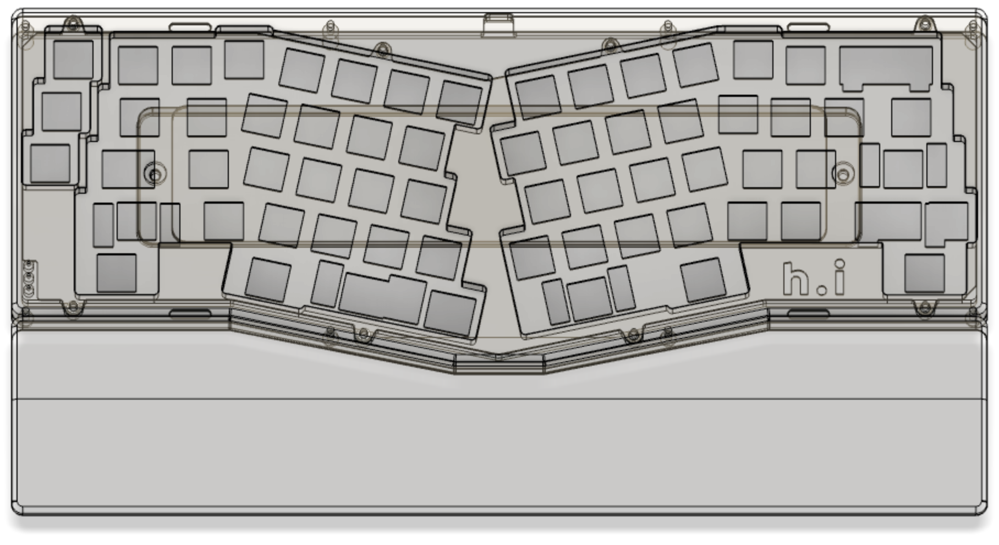
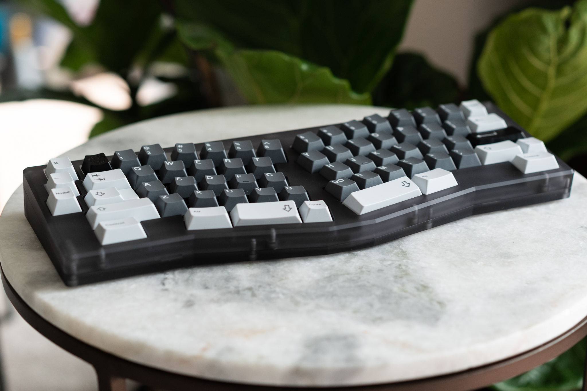

# Amano

Case, wrist rest, and packaging design files for Amano, an Alice layout keyboard. 

## Files  
### Keyboard  
* [Top Case](STEPs/top-case.step) 
* [Bottom Case](STEPs/bottom-case.step)
* [Plate With Logo](STEPs/plate-with-logo.step)

### Wrist Rest 
* [Wrist Rest](STEPs/wrist-rest.step)

### Packaging 
* [Foam Insert](STEPs/foam-insert.step)

## Terms
The files within this repository are licensed under the Creative Commons Attribution-NonCommercial-ShareAlike 4.0 International (CC BY-NC-SA 4.0).
Please refer to the [LICENSE.md](LICENSE.md) for more details

## Images

